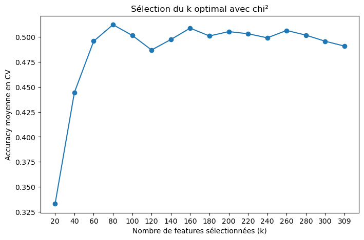
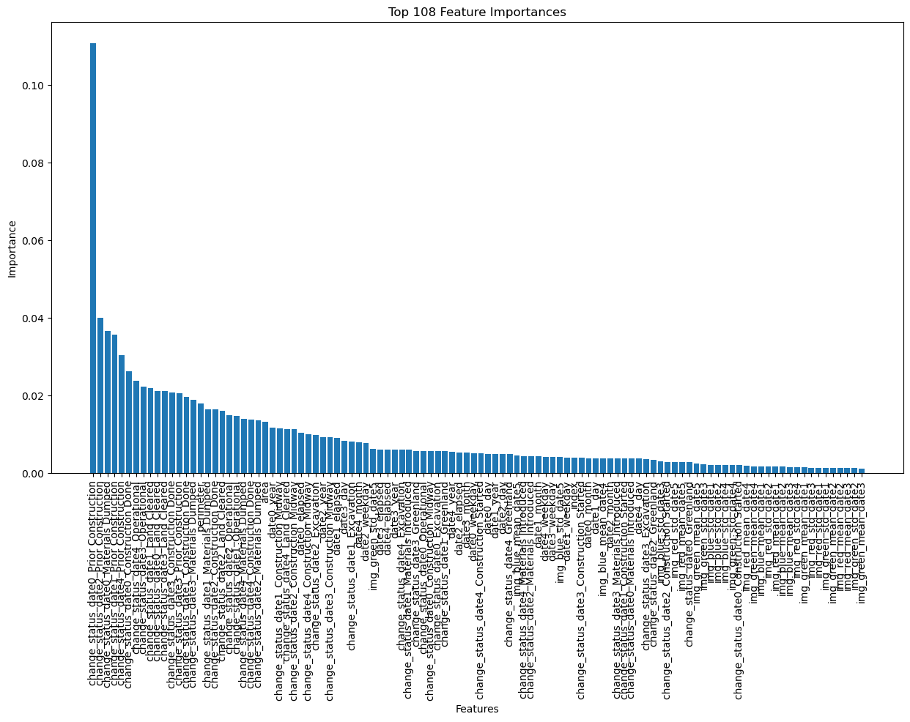

# urban-change-classification

Classification du type de transformation urbaine à partir d'imagerie satellite multi-dates — challenge Kaggle du cours de Machine Learning (CentraleSupélec, 2EL1730).

**Exactitude finale : 62 % en validation croisée**, sur six classes déséquilibrées, avec un XGBoost accordé par recherche aléatoire.

## Le problème

Chaque observation est une **parcelle** (un polygone géoréférencé) observée à **cinq dates**. À chaque date sont relevés un statut d'avancement de chantier et des statistiques colorimétriques de l'image satellite (moyenne et écart-type par canal RVB) ; s'y ajoutent des descripteurs urbains et géographiques. Il faut prédire la nature du changement en cours :

`Demolition` · `Road` · `Residential` · `Commercial` · `Industrial` · `Mega Projects`

La difficulté tient moins à la taille du jeu de données qu'à la **faible séparabilité des classes** : un chantier commercial et un chantier industriel suivent des trajectoires temporelles très voisines. Le plafond de 62 % s'explique largement par là.

## Démarche

### Construire des variables à partir de dates et de formes

Les données brutes ne sont pas exploitables telles quelles par un modèle à base d'arbres. Trois transformations font l'essentiel du travail :

**Les dates deviennent deux informations distinctes.** D'une part la position absolue dans le temps (année, mois, jour, jour de semaine) ; d'autre part le **délai écoulé** depuis la première observation. La seconde est la plus utile : elle mesure la *vitesse* de transformation, et un lotissement résidentiel ne progresse pas au rythme d'un mégaprojet.

**La géométrie devient surface et périmètre.** L'échelle sépare assez bien les classes — grandes emprises pour l'industriel et les mégaprojets, petites pour le résidentiel. J'y ai ajouté la **compacité** (`4π·aire / périmètre²`), qui vaut 1 pour un disque et tend vers 0 pour une forme allongée : c'est précisément ce qui distingue une route d'une parcelle bâtie.

**Les statuts de chantier deviennent des indicatrices.** Un `OneHotEncoder` complet sur toutes les variables catégorielles produisait un espace très creux, dont la majorité des colonnes n'apportaient rien. `pd.get_dummies` restreint aux seuls statuts donne un espace plus compact et de meilleurs résultats.

### Réduire la dimension

L'encodage produit **309 variables**. Deux approches convergent vers le même constat :

- une courbe `SelectKBest` (khi-deux) évaluée par validation croisée à `k` croissant ;
- l'importance cumulée des variables d'un XGBoost entraîné.

La courbe grimpe brutalement jusqu'à `k ≈ 60`, culmine vers **80**, puis stagne — ajouter des variables au-delà n'apporte plus rien. Sur les 108 variables les plus importantes, **81 suffisent à couvrir 95 % de l'importance cumulée**.



### Comparer les modèles

| Modèle | Exactitude (CV) | Commentaire |
|---|---:|---|
| k plus proches voisins | ~40 % | Handicapé par la dimension |
| Random Forest | 50–52 % | Robuste mais plafonne vite |
| **XGBoost accordé** | **62 %** | 50 tirages de recherche aléatoire, ~12 h de calcul |

**Pourquoi k-NN échoue.** En grande dimension, les distances euclidiennes se concentrent : toutes les parcelles finissent à peu près équidistantes et le vote des voisins devient arbitraire. Réduire le nombre de variables ne l'a pas fait dépasser 42 %.

**Pourquoi la forêt plafonne.** Elle encaisse bien la dimension, mais sans correction séquentielle des erreurs, elle se heurte au recouvrement entre classes voisines. Le boosting, qui pondère à chaque itération les exemples mal classés, gagne les dix points restants.

**La recherche aléatoire plutôt qu'une grille.** À budget égal, une grille exhaustive dépense la plupart de ses essais à faire varier des paramètres sans effet. La recherche aléatoire couvre bien mieux les dimensions qui comptent réellement — ici `max_depth` et `learning_rate`.



Le classement est net : les **statuts de chantier dominent tout le reste**. `change_status_date0_Prior Construction` pèse à lui seul 11 % de l'importance totale, soit près de trois fois la variable suivante, et les modalités `Materials Dumped`, `Construction Done` et `Excavation` occupent le haut du tableau. Les variables géométriques (`area`, `perimeter`) arrivent en milieu de classement, et les composantes de date plus bas encore.

Les statistiques colorimétriques de l'image (`img_red_mean`, `img_blue_std`…) ferment la marche : prises isolément par parcelle, elles n'apportent presque rien face au statut déclaré. Autrement dit, **savoir où en est le chantier prime sur sa forme, son calendrier et son apparence**. Cela éclaire aussi le plafond de 62 % : si deux classes partagent la même séquence de statuts — un chantier commercial et un chantier industriel, typiquement — les variables les plus informatives ne les distinguent pas.

## Utilisation

```bash
git clone https://github.com/louisjeromejamin-pixel/urban-change-classification.git
cd urban-change-classification
pip install -r requirements.txt
```

Le pipeline dispersé dans le notebook est disponible comme module réutilisable :

```python
import geopandas as gpd
from src.features import build_features, encode_target, align_columns, drop_missing_rows
from src.models import tune_xgboost, cumulative_importance_features, make_submission

train = gpd.read_file("data/train.geojson")
test = gpd.read_file("data/test.geojson")

y = encode_target(train["change_type"])
X, y = drop_missing_rows(train.drop(columns=["change_type"]), y)

X = build_features(X)
X_test = build_features(test)
X, X_test = align_columns(X, X_test)

search = tune_xgboost(X, y, n_iter=50)
print(search.best_params_, search.best_score_)

kept = cumulative_importance_features(search.best_estimator_, list(X.columns), 0.95)
make_submission(search.best_estimator_, X_test[kept], test["index"])
```

Le [notebook](notebooks/urban_change_classification.ipynb) conserve le déroulé complet avec ses sorties et ses graphiques.

> **Données.** Les fichiers `train.geojson` et `test.geojson` proviennent de la compétition Kaggle du cours et ne sont pas redistribués ici. Placez-les dans `data/`.

## Structure

```
src/
├── features.py   # dates -> composantes, géométrie -> aire/périmètre/compacité,
│                 # encodage, alignement train/test, réduction mémoire
└── models.py     # références k-NN et forêt, courbe SelectKBest,
                  # recherche XGBoost, importance cumulée, soumission
notebooks/
└── urban_change_classification.ipynb   # déroulé complet avec sorties
docs/
└── rapport.pdf   # rapport remis (anglais)
tests/            # 14 tests du pipeline de features
```

## Tests

```bash
pip install pytest
python -m pytest tests -q
```

Les tests s'exécutent sans les données du challenge, sur un substitut de géométrie. Ils couvrent l'extraction des composantes de date, le calcul du délai écoulé, la compacité (vérifiée analytiquement : exactement 1 pour un disque), l'alignement train/test lorsqu'une modalité manque d'un côté, et l'aller-retour d'encodage de la cible.

## Ce que je ferais différemment

- **Traiter le déséquilibre des classes.** Le score global masque des écarts importants entre classes ; une pondération ou un rééchantillonnage, et surtout un **F1 macro** plutôt que l'exactitude, donneraient une image plus juste.
- **Passer à l'optimisation bayésienne.** Douze heures pour 50 tirages aléatoires : Optuna atteindrait le même optimum en bien moins d'essais.
- **Exploiter les transitions de statut.** J'ai encodé chaque statut de date indépendamment, alors que l'information utile est la **séquence** — le passage d'un état à l'autre entre deux relevés en dit plus que les états pris isolément.
- **Ajouter du contexte spatial.** Distance au centre urbain ou aux axes routiers, densité du voisinage : autant de signaux absents ici et probablement discriminants.

## Crédits

Projet d'équipe réalisé avec **Julian Debes**, **Hugo Fillet** et **Théophile Lahaussois** dans le cadre du cours 2EL1730 (CentraleSupélec, février 2025). Le [rapport](docs/rapport.pdf) est le document remis pour l'évaluation.

Ce dépôt réorganise le code du notebook en modules réutilisables, avec tests et documentation.
